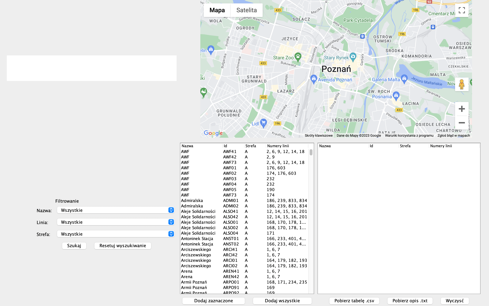

# ZTM Bus Stop browser
Project created for *Advanced Object and Functional Programming* course, Data Science studies in the winter semester 2022/23 ☕️🕹

## About project
ZTM Bus Stop browser is a Java window application created using the Swing library. The application displays selected ranges of data, downloaded from the public API of the Poznań city service, in a table and on a Google Maps 🗺. The application allows you to filter and export selected data and mark the nearest available stop on the map.

## Screenshots

### Default view

             

### Marked line 145

### Marking any stops on the map
Information about the last nearest found stop is displayed

## Authors
Data Science students at Warsaw University of Technology:
* [Maciej Borkowski](https://github.com/BorkowskiMaciej)
* [Marta Szuwarska](https://github.com/szuvarska)